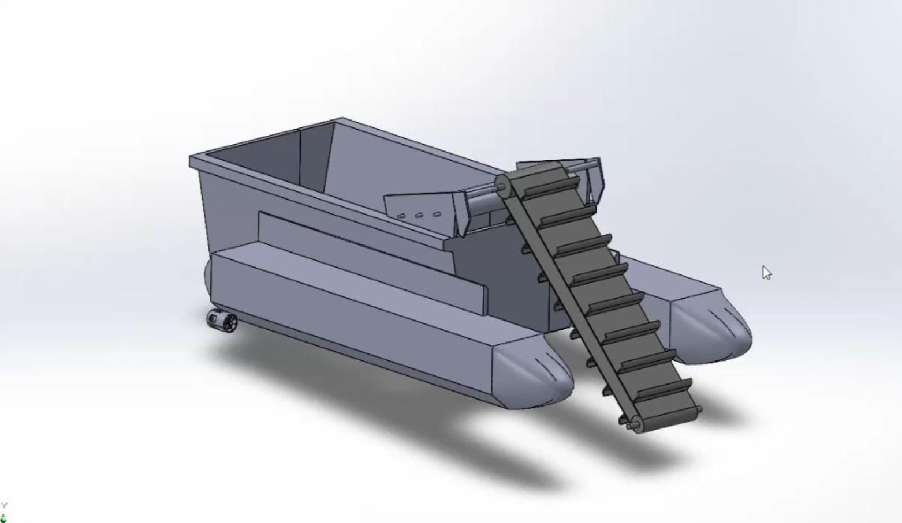
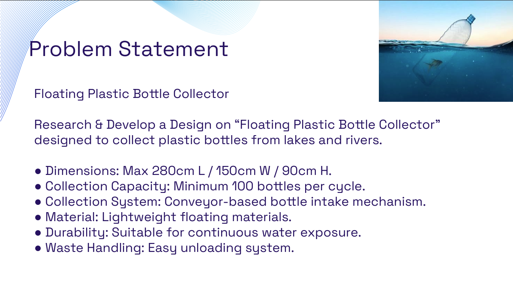
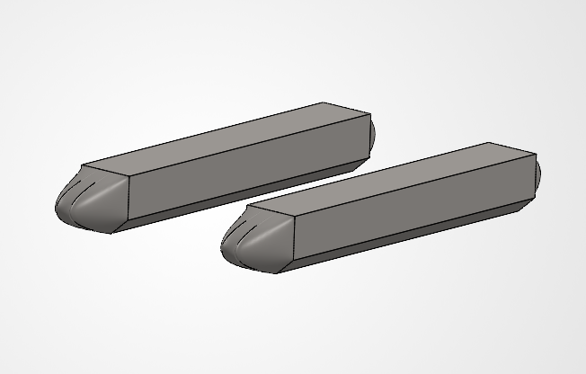
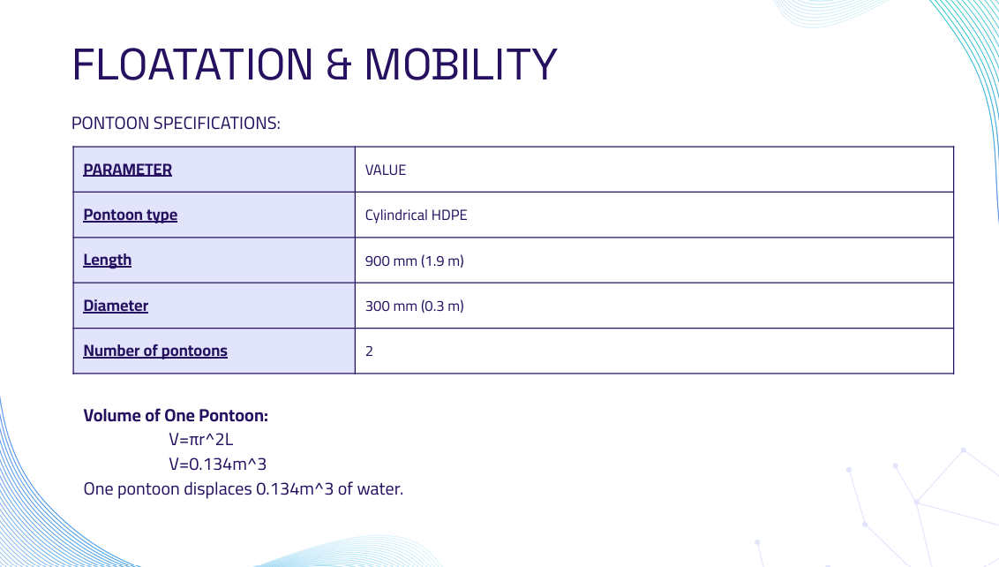
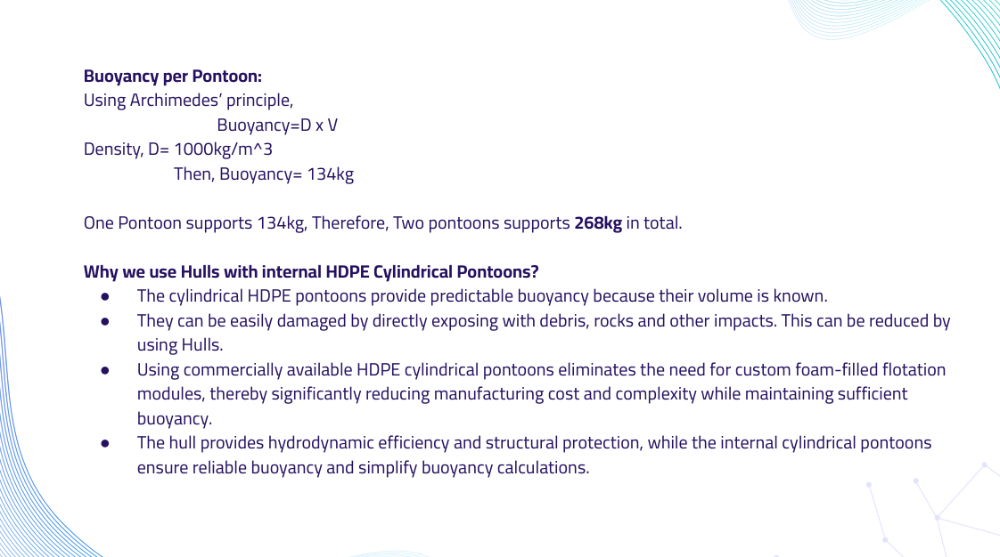
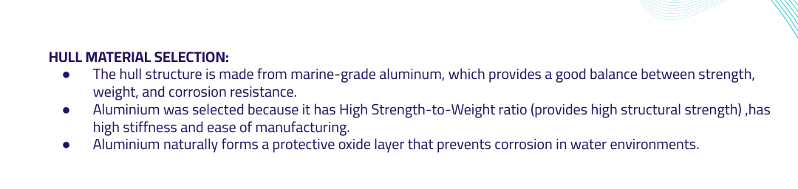

# Floating Plastic Bottle Collector

## Overview

A floating plastic waste collection platform designed to collect plastic bottles and floating debris from lakes and rivers. The system utilizes a conveyor-based collection mechanism integrated with a catamaran-style floating platform to ensure stability, buoyancy, and operational efficiency.

---

## Final Design

---

## Problem Statement

### Design Requirements

- Maximum Dimensions: 280 cm × 150 cm × 90 cm
- Collection Capacity: Minimum 100 bottles per cycle
- Conveyor-based bottle intake mechanism
- Lightweight floating structure
- Suitable for continuous water exposure
- Easy unloading system

---

## Design Concept

The final concept consists of:

- Dual HDPE cylindrical pontoons
- Marine-grade aluminum hull structure
- Conveyor-based collection mechanism
- Central waste storage compartment

### Pontoon Design

---

## Flotation & Mobility Analysis

### Pontoon Specifications

| Parameter | Value |
|------------|---------|
| Pontoon Type | Cylindrical HDPE |
| Length | 1900 mm |
| Diameter | 300 mm |
| Number of Pontoons | 2 |

### Buoyancy Calculation

Volume of one pontoon:

V = πr²L

V = π × (0.15)² × 1.9

V ≈ 0.134 m³

Buoyancy per pontoon:

≈ 134 kg

Total buoyancy:

≈ 268 kg

---

## Material Selection

### Why HDPE Pontoons?

- Predictable buoyancy characteristics
- Corrosion resistant
- Low maintenance
- Commercially available
- Cost effective

### Why Marine Grade Aluminum?

- High strength-to-weight ratio
- Corrosion resistance
- Structural stiffness
- Ease of manufacturing

---

## Engineering Decisions

### Why Use Hulls with Internal HDPE Pontoons?

- Protects pontoons from debris and impact damage
- Improves hydrodynamic performance
- Reduces manufacturing cost compared to custom flotation modules
- Simplifies buoyancy calculations and maintenance

---

## Engineering Skills Demonstrated

- Mechanical Design
- CAD Modeling
- Product Development
- Material Selection
- Buoyancy Analysis
- Design for Manufacturability (DFM)
- Engineering Documentation

---

## Project Outcome

- Designed a floating plastic waste collection system capable of collecting over 100 bottles per cycle.
- Validated flotation requirements through buoyancy calculations.
- Selected lightweight and corrosion-resistant materials for long-term operation.
- Developed a complete CAD model and engineering documentation.
- Recognized as a winning solution in a design hackathon.
